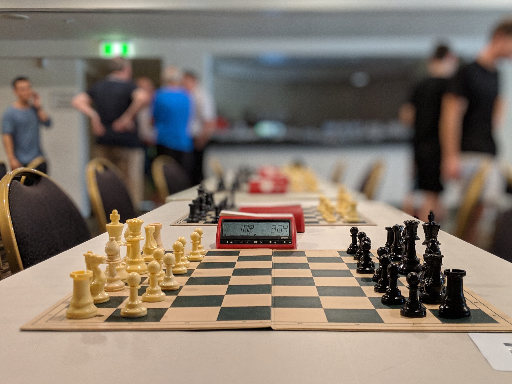

## Welcome to chess club's website!

We are an inclusive club that supports all levels of expertise. Whether you are a novice or regularly play in tournaments there is a place for you at chess club. Before quarantine chess club used to meet almost everyday at lunch to just play and have fun. Even though we cannot do this anymore we are still hosting online tournaments. 

## Some Upcoming Activities 
- Weekly tournaments on 
[Lichess.org](https://lichess.org/) with a leaderboard
- Online intra-school tournaments (with schools like Sunny High and Oxford)
- We had our first general meeting on 9/25/2020 but stay tuned for the next one!

## How to Get Involved
- join our google classroom - code: 7CCHC71
- follow us on instagram - @whitney.chessclub
- feel free to reach out to cabinet if you have any questions!

