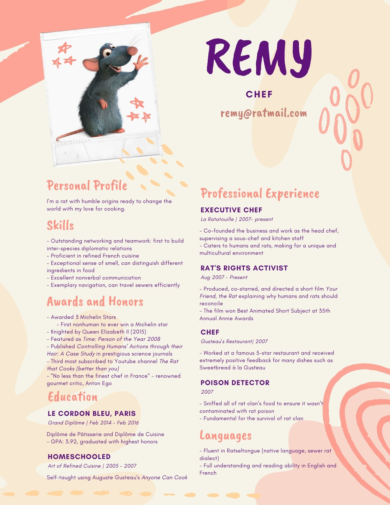

## Welcome to chess club's website!


We are an inclusive club that supports all levels of expertise. Wether you are a novice or regularly play in tournaments there is a place for you at chess club. Before quarantine chess club used to meet almost everyday at lunch to just play and have fun. Even though we cannot do this anymore we are still hosting online tournaments. 

## Some Upcoming Activities 
- Weekly tournaments on 
[Lichess.org](https://lichess.org/) with a leaderboard
- Online intra-school tournaments (with schools like Sunny High and Oxford)
- We had our first general meeting on 9/25/2020 
- Stay tuned until then

## How to Get Involved
- join our google classroom - code: 7CCHC71
- follow us on instagram - @whitney.chessclub
- feel free to reach out to cabinet if you have any questions!

One of our 


```markdown


Syntax highlighted code block

# Header 1
## Header 2
### Header 3

- Bulleted
- List

1. Numbered
2. List

**Bold** and _Italic_ and `Code` text

[Link](url) and 
```

For more details see [GitHub Flavored Markdown](https://guides.github.com/features/mastering-markdown/).

### Jekyll Themes

Your Pages site will use the layout and styles from the Jekyll theme you have selected in your [repository settings](https://github.com/HappySphingolipid/automatic-octo-guacamole/settings). The name of this theme is saved in the Jekyll `_config.yml` configuration file.

### Support or Contact

Having trouble with Pages? Check out our [documentation](https://docs.github.com/categories/github-pages-basics/) or [contact support](https://github.com/contact) and we’ll help you sort it out.
